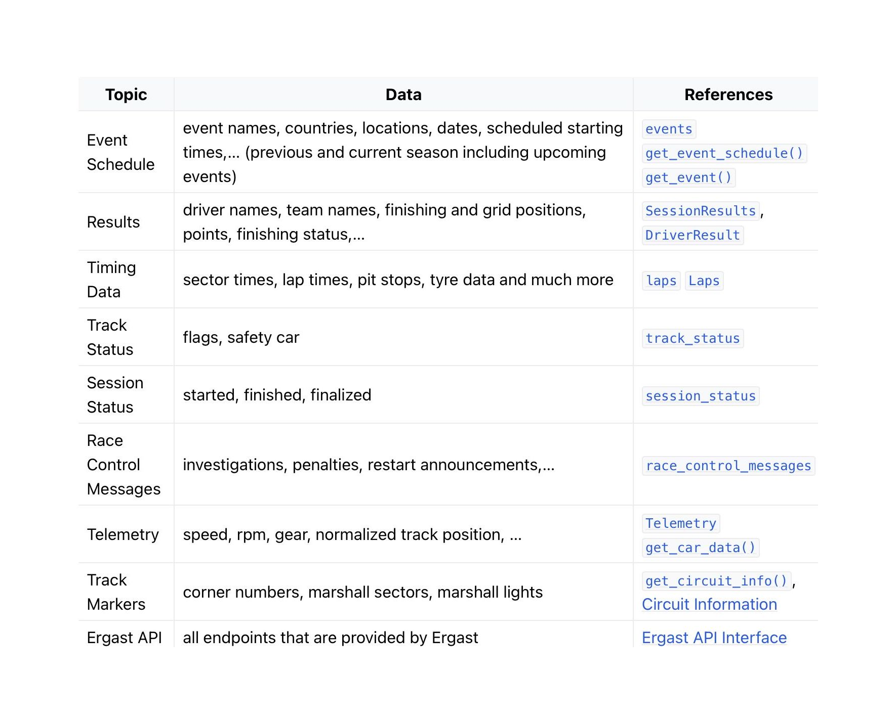

# Project of Data Visualization (COM-480)

| Student's name | SCIPER |
| -------------- | ------ |
|Arundhati Balasubramaniam |376347|
| Hans Kristian Bjørgo Kværum|381875|
| Riccardo Lionetto|370934|

[Milestone 1](#milestone-1) • [Milestone 2](#milestone-2) • [Milestone 3](#milestone-3)

## Milestone 1

### Dataset

**Fast-F1 library** is the selected dataset. To be specific, it is a python package providing access to a wide range of Formula 1 data including timing, results, schedules and telemetry. 
It is important to note data access requires the use of an API. By utilizing the Ergast F1 endpoint, we can retrieve the required data in JSON format or as a flattened Pandas dataframe and store them in our server, to overcome the fact that the Ergast API is deprecated and will shutdown by the end of 2024. However, after thorough testing, it has been confirmed that functionalities are currently fully operational.
    
It consist of 13 main calls, including `get_race_schedule`, `get_seasons`, `get_qualifying_results`, `get_circuits` and `get_constructor_info` among others. 

Timing data, session information, car telemetry and position data are available from 2018 onwards. Schedule information and session results are available for older seasons as well, going back as far as 1950 (limited to data that is available through Ergast).
    
[Formula 1 World Championship (1950 - 2023)](https://www.kaggle.com/datasets/rohanrao/formula-1-world-championship-1950-2020) is a Kaggle dataset that sourced data from Ergast (FastF1) and made it available to download. For this reason, this dataset will be prioritized for use, with data fetching from FastF1 only occurring when the desired data is unavailable in the Kaggle dataset.

### Problematic

Initiated in 1950, Formula 1 stands as the pinnacle of motor sport, renowned for its prestige, widespread popularity and technical brilliance. Considered one of the most data-driven sports, modern Formula 1 cars have 300 sensors producing approximately 100,000 data points per second, accumulating [1.5 terabytes of data over the course of a race](https://www.forbes.com/sites/joelshapiro/2023/01/26/data-driven-at-200-mph-how-analytics-transforms-formula-one-racing/?sh=6f330cc639db). All this data is analyzed to inform everything from car design to racing strategy and driver skill.

For this project, we aim to make F1 accessible to those with a novice to intermediate understanding of motor racing, but who require a more visual explanation to comprehend the intricacies of the sport. We will focus on visualizations that talk about not only the Driver’s statistics across seasons and grand prix races, but also look at other factors like circuits, car performance, race calendars and point scoring-rules.

More specifically, our project aims to provide visualisations for exploring the following:
1. Driver and teammate battles - how are two or more drivers performing across races, qualifyings and seasons?
2. Circuit statistics - how many races have been held at a specific circuit? Which driver has had the most success there (wins, podiums, pole positions)?
3. GOAT-debate: who is the greatest driver of all time in pure numbers?
4. Race calendar environmental impact - how could the race calendar be reorganized to minimize environmental impact/race2race travel mileage?
5. How would a different point scoring system affect seasonal championship outcomes? 

### Exploratory Data Analysis
Data pre-processing was made leveraging Python and is available in this [Jupiter Notebook](https://colab.research.google.com/drive/1LIcPUWiL35Zr-ITAFHjLXjy9uRplidLj?usp=sharing).

> Pre-processing of the data set you chose
> Show some basic statistics and get insights about the data

### Related work
1. In [this](https://jasonjpaul.squarespace.com/formula-1-data-vis) website, Jason Paul outlines his process for understanding who is the greatest driver of all time, with a unique storytelling approach which acts as a choose-your-own-adventure structure for the user to click through.
2. [This](https://f1-visualization.vercel.app) website, developed by Yannick Gloster, allows the user to see the race in an interesting dynamic visualisation, but does not provide much more information.
3. [This](https://uxdesign.cc/visualizing-career-flows-in-sports-formula-1-3d88feca257c) visualisation is a static representation of the entire career of a particular team or a driver, designed by Ruban B.
4. [This](https://www.f1-tempo.com) website lets the user create simple Formula 1 lap time and telemetry graphs utlizing data from [Fast-F1](https://github.com/theOehrly/Fast-F1/tree/master).

Our visualisation aims to be dynamic and interactive, while simultaneously guiding the user through the platform. While the visualisations should invite exploration, we also seek to present new insights regarding the impact(s) of point systems, race calendars and rule changes. While not an entirely novel topic, we aim to differentiate ourselves by bringing new perspectives through an interesting and interactive data story catering a broad audience.

## Milestone 2 (26th April, 5pm)

## Milestone 3 (31st May, 5pm)

